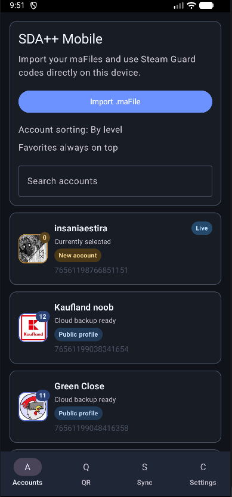
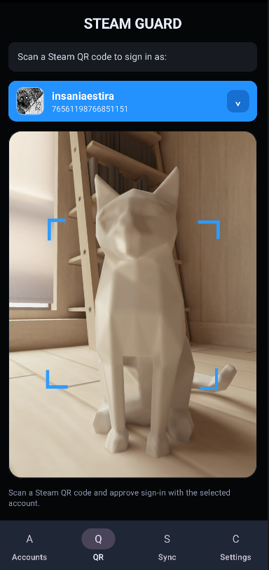
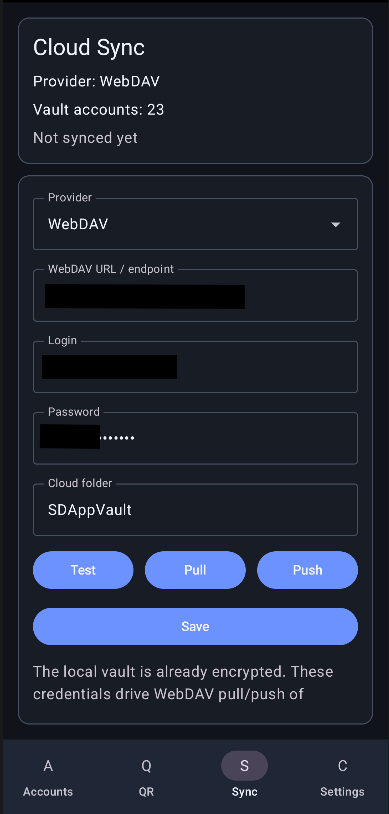
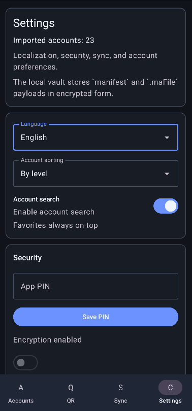
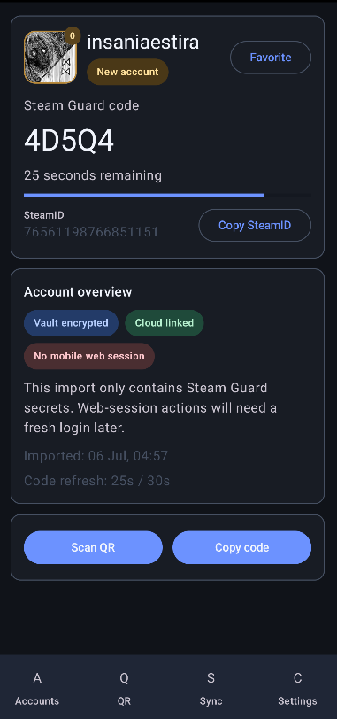
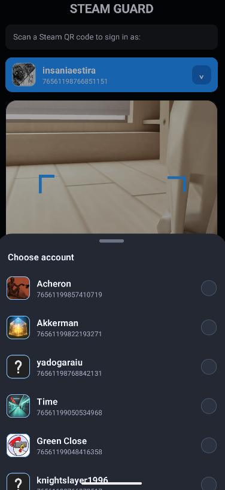

# SDA++ Mobile

<p align="center">
  
</p>

<p align="center">
  Steam Guard authenticator for Android with encrypted local storage, QR sign-in approval, WebDAV synchronization, and multi-account tools.
</p>

<p align="center">
  
  
  
</p>

SDA++ Mobile is an independent Steam utility for managing your own authenticator accounts. It is not affiliated with Valve or Steam.

## Download

Download `SDAplusplus-Mobile-0.4.0.apk` from [GitHub Releases](https://github.com/ManeWreck/SDA-plus-plus-mobile/releases/latest).

Android may ask for permission to install applications from your browser or file manager. Updating the app over an existing installation preserves the encrypted local vault.

## Features

- Encrypted local storage for imported `.maFile` account data
- On-device Steam Guard code generation
- Steam QR sign-in scanning and approval
- WebDAV synchronization of encrypted account backups
- PIN and biometric application lock
- Account avatars, persona names, Steam levels, favorites, sorting, and search
- English and Russian interface
- Combined Steam confirmations for supported accounts with Accept and Reject actions
- Account session tools, including termination of active Steam sessions
- Encrypted one-scan transfer of WebDAV settings to SDA++ Desktop
- Local-network pairing with automatic HTTPS relay fallback when direct access is unavailable

## Screenshots

| Accounts | QR Scanner |
| --- | --- |
|  |  |

| Cloud Sync | Settings |
| --- | --- |
|  |  |

| Account Detail | QR Account Picker |
| --- | --- |
|  |  |

## Getting Started

1. Install the APK and open SDA++ Mobile.
2. Import one or more `.maFile` files from a trusted SDA/SDA++ backup.
3. Configure an application PIN and biometrics.
4. Optionally configure WebDAV to synchronize the encrypted vault.
5. Select an account to view its Steam Guard code or approve a Steam QR sign-in.

Modern QR approval, confirmations, and account session tools require the imported account to contain a valid Steam mobile web `Session`. Accounts without one can still generate Steam Guard codes and use encrypted backup synchronization.

## Desktop Pairing

On the SDA++ Desktop welcome screen, choose **Connect cloud from SDA++ Mobile with one scan**. Scan the two-minute QR code with the unlocked mobile application and confirm sharing the WebDAV connection.

Pairing uses ephemeral P-256 ECDH and AES-256-GCM. The application sends only the WebDAV URL, login, application password, and cloud folder. Steam secrets, account files, and vault keys are never included. Direct local transfer is attempted first; if the devices cannot reach each other, the same encrypted payload is sent through the SDA++ HTTPS relay and deleted after its first successful download.

## Security

- The local vault and imported account files are encrypted with keys protected by Android Keystore.
- WebDAV credentials are stored in encrypted application preferences.
- Passwords, session tokens, and Steam secrets are not written to application logs.
- Session termination and confirmation actions require an authenticated Steam session.
- Public builds do not contain personal `.maFile`, manifest, credential, token, or backup files.

Keep a separate encrypted backup of your authenticator files. Losing both the device and every backup can permanently remove access to Steam Guard codes.

## Building

Requirements:

- Android Studio
- Android SDK 34
- JDK 17

```powershell
cd .\SDAplusplus-Mobile
.\gradlew assembleDebug
```

The APK is generated at `app/build/outputs/apk/debug/app-debug.apk`.

## Repository Layout

- `SDAplusplus-Mobile/` - Android application and shared modules
- `pairing-relay/` - encrypted Cloudflare Worker fallback for desktop pairing
- `assets/screenshots/` - screenshots used on the project page

## Support

- GitHub: [ManeWreck](https://github.com/ManeWreck)
- Ko-fi: [ko-fi.com/manewreck](https://ko-fi.com/manewreck)

## License and Disclaimer

SDA++ Mobile is an unofficial project and is not endorsed by Valve. Use it only with accounts you own and keep secure backups of all authenticator data.
